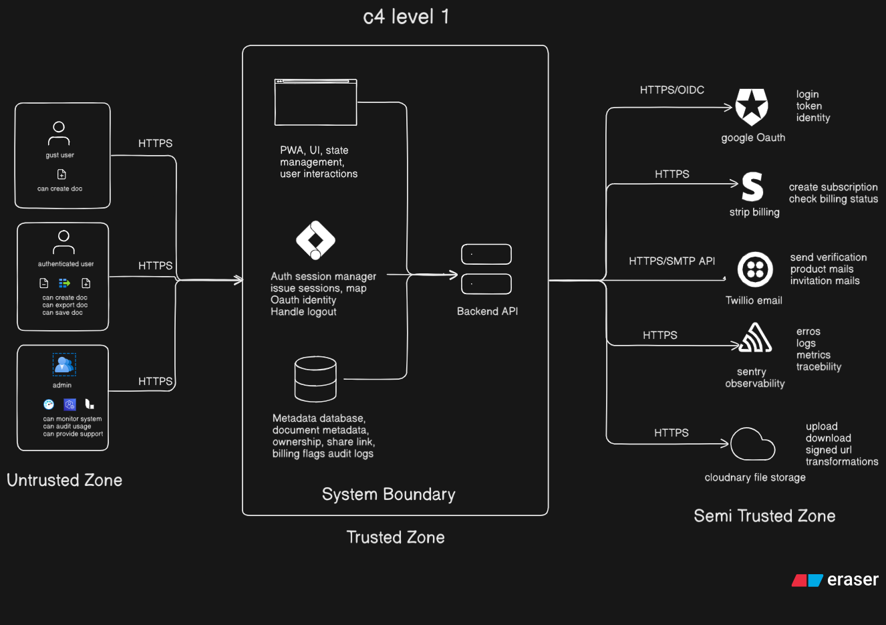

# System Context — Digramyx
## 1. Purpose

Diagramyx MVP is a web-based diagram system that enables users to create, store, share, and export documents with secure authentication and cloud-backed storage.

### System Context Diagram (C4 Level 1)

Shows:

* Your **system boundary (Diagramyx)** 
* **Primary users**
* **External systems** 
* **High-level data exchanges**

#
---

## 2. System Boundary

### Inside the Boundary

* Web Client 
* Backend API
* Auth Session Manager
* Metadata Database

---

## 3. Actors

### Guest User

* Access shared documents
* create temporary docs 

### Authenticated User

* Create, edit, save, export documents
* Upload assets
* Share documents via secure links
* Manage subscription

### Admin

* Monitor system health
* Audit usage & logs
* Handle abuse & support

---

## 4. External Integrations

| Service      | Purpose        | Data                          |
| ------------ | -------------- | ----------------------------- |
| Google OAuth | Authentication | ID token, profile             |
| Stripe       | Billing        | subscription status, webhooks |
| Twilio       | Email          | verification & share links    |
| Cloudinary   | Storage        | file uploads, URLs            |
| Sentry       | Observability  | errors, metrics               |

---