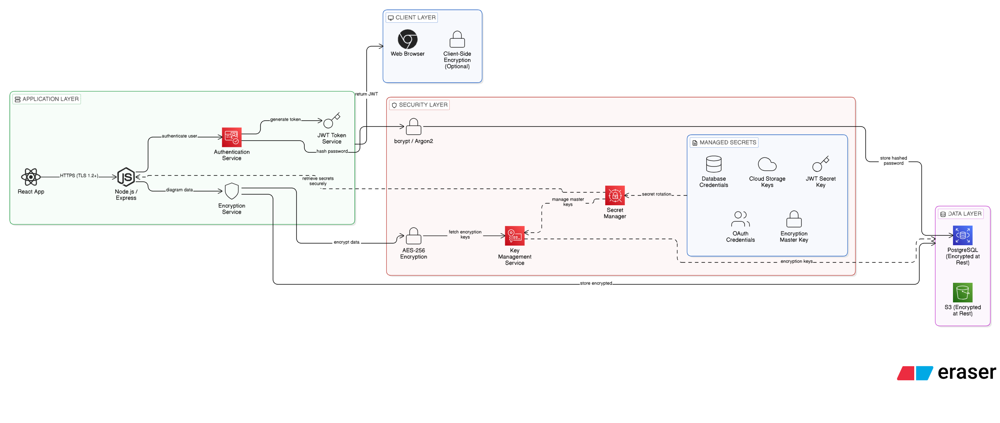

# Secret Management & Authentication – Diagramyx

 ## 1. Purpose

 Diagramyx MVP is a secure, web-based diagram system built with strong authentication, JWT-based session management, and Role-Based Access Control (RBAC).

 The platform ensures:

* Secure user authentication

* JWT-based stateless authorization

* Centralized secret management

* Encrypted data storage

* Controlled access using roles (User/Admin)

### Authentication & JWT Architecture (C4 – Level 1)

Shows:

* Complete authentication flow

* JWT token generation & verification

* Role-based access validation

* Secure API access control

## 2.System Boundary

Inside the Boundary

* User Authentication
* JWT Token Generation
* JWT Secret Management
* Role-Based Access Control (RBAC)
* Secure Data Handling

___

## 3.Actors

### Guest User

* Can access limited public endpoints

* Cannot create or modify diagrams

* No JWT token issued

### Authenticated User

* Register & Login securely

* Receive signed JWT token

* Create, edit, delete own diagrams

* Access only authorized resources

* Data stored securely in database

### Admin

* All USER permissions

* Access system monitoring endpoints

* View audit logs

* Manage users

* Handle abuse reports

* Override restricted content if necessary

## 4. External Integrations

### Google OAuth

* When authentication is handled via Google OAuth:

* Identity tied to Google account

* JWT still generated internally after OAuth validation

* Role assigned in application database

* If Google access is lost → app login access may also be lost